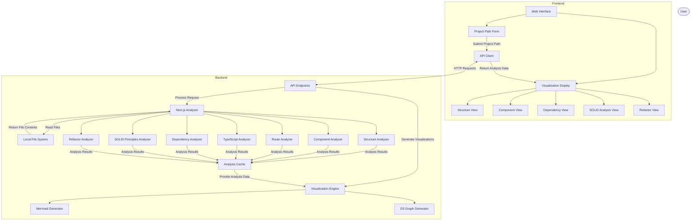

# Product Requirements Document
# Refactor - Next.js TypeScript Analyzer

## 1. Introduction

### 1.1 Purpose
The Next.js TypeScript Analyzer is a development tool designed to help developers understand, visualize, and refactor their Next.js TypeScript projects. By providing visual representations of code structure, component relationships, dependency mapping, and SOLID principle analysis, the tool aims to improve developer understanding and facilitate better architectural decisions.

### 1.2 Scope
This application will focus exclusively on analyzing Next.js projects written in TypeScript. It will provide visual tools for understanding project structure, component hierarchies, routing patterns, type relationships, dependency graphs, and adherence to SOLID principles.

### 1.3 Target Users
- Frontend developers working with Next.js
- Technical leads reviewing Next.js codebases
- New team members onboarding to existing Next.js projects
- Developers looking to refactor or improve their Next.js architecture

## 2. Product Overview

### 2.1 Product Description
The Next.js TypeScript Analyzer is a standalone application with a web-based interface that allows developers to analyze their local Next.js projects. It scans project files, parses TypeScript code, and generates interactive visualizations that help developers understand different aspects of their codebase.

### 2.2 Key Features
1. **Project Structure Visualization**: Interactive directory and file structure visualization
2. **Component Analysis**: Component hierarchy and dependency graphs
3. **Route Visualization**: Visual representation of Next.js routes (both Pages and App Router)
4. **TypeScript Analysis**: Type relationship diagrams and usage patterns
5. **Dependency Mapping**: Visual representation of module dependencies
6. **SOLID Principles Analysis**: Identification of potential SOLID principle violations
7. **Refactor Suggestions**: Actionable recommendations to resolve identified issues
8. **Interactive Exploration**: Ability to explore and navigate through visualization results

### 2.3 Tech Stack
#### Frontend:
- **Framework**: Vite
- **State Management**: React Query
- **API Communication**: Axios
- **Styling**: Tailwind CSS & Shadcn UI
- **Visualization Libraries**:
  - D3.js for interactive graphs
  - Mermaid.js for flowcharts and diagrams
  - React Flow for node-based visualizations

#### Backend:
- **Runtime**: Node.js
- **Framework**: Express.js
- **Language**: TypeScript
- **Parsing Tools**:
  - @typescript-eslint/typescript-estree for TypeScript parsing
  - babel-parser as an alternative parser
- **File System**: fs-extra and glob for enhanced file operations

## 3. Feature Requirements

### 3.1 Structure Analysis
- The system must scan the entire project directory
- It must identify key Next.js directories (pages, app, components, etc.)
- It must categorize files based on their purpose and location
- It must generate an interactive tree view of the project structure

### 3.2 Component Analysis
- The system must identify React components in TSX files
- It must extract component props and their TypeScript definitions
- It must detect common patterns (HOCs, hooks usage, etc.)
- It must map parent-child relationships between components
- It must visualize the component hierarchy as an interactive graph

### 3.3 Route Analysis
- The system must support both App Router and Pages Router
- It must identify dynamic routes and their parameters
- It must detect data fetching methods associated with routes
- It must generate a visual map of the application's routing structure

### 3.4 TypeScript Analysis
- The system must extract TypeScript interfaces, types, and enums
- It must identify prop types used by components
- It must detect common type patterns and structures
- It must generate relationship diagrams for complex types

### 3.5 Dependency Mapping
- The system must parse import statements from all project files
- It must create a directed graph representing module dependencies
- It must identify circular dependencies and potential issues
- It must visualize the dependency graph using Mermaid.js diagrams
- It must allow filtering dependencies by directory or file type

### 3.6 SOLID Principles Analysis
- The system must check for Single Responsibility Principle (SRP) violations:
  - Identify components/classes with multiple distinct responsibilities
  - Flag large files that may benefit from decomposition
- The system must check for Open/Closed Principle indicators
- The system must analyze inheritance patterns for Liskov Substitution Principle issues
- The system must identify Interface Segregation Principle opportunities:
  - Detect large interfaces that could be split
  - Identify unused props in components
- The system must check for Dependency Inversion Principle adherence:
  - Identify tightly coupled modules
  - Detect direct dependencies on concrete implementations

### 3.7 Refactor Suggestions
- The system must provide actionable recommendations to address identified issues
- It must suggest specific code changes to improve adherence to best practices
- It must prioritize suggestions based on impact and complexity
- It must provide before/after code examples for recommended changes
- It must allow users to export refactoring suggestions as a report

### 3.8 User Interface
- The system must provide an interface for selecting a local Next.js project
- It must display a dashboard with different visualization views
- All visualizations must be interactive (zoom, pan, click)
- It must provide search functionality for finding components/files
- It must offer a consistent tabbed interface for navigating between different analysis views

## 4. System Components

### 4.1 Frontend Components
- **Project Selection**: UI for selecting local Next.js project directory
- **Analysis Dashboard**: Main interface showing visualization results
- **Structure View**: Tree-based visualization of project structure
- **Component View**: Graph visualization of component relationships
- **Dependency View**: Directed graph visualization of module dependencies
- **SOLID Analysis View**: Dashboard showing potential SOLID violations
- **Refactor View**: Interface for viewing and implementing suggested improvements

### 4.2 Backend Components
- **File System Interface**: For reading project files
- **TypeScript Parser**: For parsing and analyzing TypeScript code
- **Next.js Analyzer**: Core analysis engine with specialized analyzers
- **Dependency Analyzer**: For mapping module dependencies
- **SOLID Analyzer**: For checking SOLID principles adherence
- **Visualization Generator**: For creating visual representations of analysis data
- **Analysis Cache**: In-memory storage of analysis results during session

## 5. Core Functionality

### 5.1 Structure Analysis
The system will analyze the project structure by:
- Scanning all directories and files in the project
- Identifying Next.js-specific directories (pages, app, components, etc.)
- Creating a hierarchical representation of the project structure
- Generating a visual tree diagram of the project organization

### 5.2 Component Analysis
The system will analyze React components by:
- Parsing TSX files to identify component definitions
- Extracting component props and their TypeScript types
- Mapping import/export relationships between components
- Identifying component hierarchies and dependencies
- Generating visual graphs of component relationships

### 5.3 Route Analysis
The system will analyze Next.js routing by:
- Identifying routes in both pages/ and app/ directories
- Detecting dynamic route segments and parameters
- Mapping relationships between routes and components
- Identifying data fetching methods associated with routes
- Generating visual representations of the application's routing structure

### 5.4 TypeScript Analysis
The system will analyze TypeScript code by:
- Extracting interface and type definitions
- Identifying type usage across components
- Mapping relationships between types
- Detecting potential type-related improvements
- Generating visual representations of type relationships

### 5.5 Dependency Mapping
The system will map dependencies by:
- Parsing import statements from all project files
- Creating a graph data structure of module dependencies
- Identifying circular dependencies and dependency chains
- Providing metrics on module coupling and cohesion
- Visualizing the dependency graph using Mermaid.js diagrams

### 5.6 SOLID Principles Analysis
The system will analyze adherence to SOLID principles by:
- Checking components for multiple responsibilities (SRP)
- Analyzing inheritance patterns for LSP violations
- Identifying tightly coupled modules that violate DIP
- Detecting large interfaces that could be split (ISP)
- Providing suggestions for improving adherence to SOLID principles

### 5.7 Refactor Suggestions
The system will provide actionable refactoring suggestions by:
- Analyzing identified issues and generating specific recommendations
- Prioritizing suggestions based on potential impact and implementation complexity
- Providing before/after code examples for each suggestion
- Allowing users to implement suggested changes directly or export them as a report
- Tracking implemented changes and their impact on code quality metrics

## 6. Implementation Phases

### 6.1 Phase 1: Core Analysis Framework
- Project structure scanning and visualization
- Basic component detection and relationship mapping
- Simple interactive UI for file exploration

### 6.2 Phase 2: Enhanced Visualizations
- Component dependency graphs
- Route structure visualizations
- Interactive exploration features

### 6.3 Phase 3: Advanced Analysis
- Dependency mapping visualization
- TypeScript type relationship analysis
- Performance optimizations for larger projects

### 6.4 Phase 4: SOLID Analysis & Refactoring
- Implementation of SOLID principles analyzers
- Development of refactoring suggestions
- Implementation of the Refactor View for applying suggested changes
- Integration of all analysis views into unified dashboard

## 7. Appendix

### 7.1 Technical Architecture Diagram



### 7.2 User Flow Diagram

```
User Input → Project Selection → Analysis Process → Results Dashboard
                                                        ├── Structure View
                                                        ├── Component View
                                                        ├── Dependency View
                                                        ├── SOLID Analysis View
                                                        └── Refactor View
```
